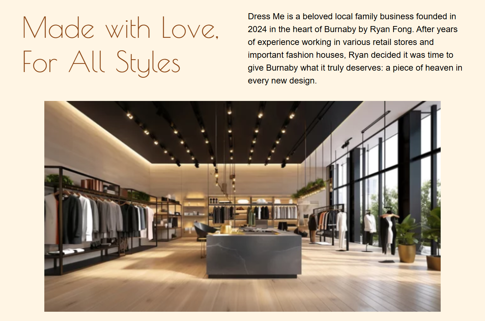
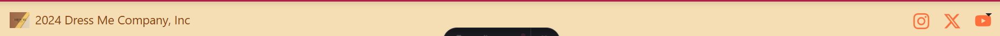

# Project: The Dress Me Co. Website

## Description
This is the website of a local Fashion Company located in Burnaby City called The Dress Me Co.

## Project Structure

The project is structured into the following folders and files:

## Features
- **Dark/Light** feature for a better user experience.

- **Navbar** This is a minimalist navigation menu that allows the customer to find what they are looking for in an easy way. 
    - The links "About Us", "Products", and "Contact Us" have a sliding effect by using GSAP.
    - The logo was designed with Canvas.
    - The location icon redirects to the Fashion location, in this case a fake location.

- **Hero** This is welcome message inviting customer to explore more about the amazing designs.

- **About Us** A small description of the founder and what inspires him everyday to create unique designs to dress Burnaby City.

- **Stories** A section at the bottom part of the main page to showcase the satisfaction and opinions of current clients to future ones.

- **Footer** A simple footer that gives access to the Social Network Links of the Company.

## Store - Products Page
- This page displays the amazing fashion designs that The Dress Me Co. has to offer.

- Each product offers the following information:
    - Price, Description and Category.

- **Add to Cart** Button

- **Show/Hide Cart** that allows the customer to add a product, hide the cart, and continue shopping.